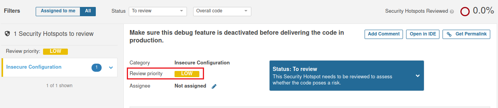

# 1. Какие баги были выявлены (количество, описание, почему SonarQube их считает багами, см. ссылку Why is this an issue?)

- Количество багов - 1

- Описание - Повторное использования переменной «Clean», необходимо ввести новую переменную.

- SonarQube считает багом, потому что перед изменением значения переменной, ее необходимо вызвать/прочитать

# 2. Какие уязвимости были выявлены (количество, категории, описание, почему SonarQube их считает уязвимостями)

- Количество уязвимостей - 1

- Описание - Добавить защиту паролем в эту базу данных.

- SonarQube считает уязвимостью, потому что базы данных всегда должны быть защищены паролем. Использование соединения с базой данных с пустым паролем является явным признаком того, что база данных не защищена.

# 3. Какие Security Hotspots были выявлены (количество, категории, приоритет, описание, почему SonarQube их считает Security HotSpot'ами)

- Количество Security Hotspots - 1

- Категория - Небезопасная конфигурация

- Приоритет - Низкий

- Описание - Отправка кода в релиз с активированными функциями отладки создает угрозу безопасности.

- SonarQube считает Security Hotspots, потому что перед отправкой кода в релиз необходимо убедиться, что функция отладки отключена.

# 4. К каким CWE идёт отсылка для Security Hotspots из п.2 (см. вкладку How can you fix it? в нижней части страницы)

# 5. Какие запахи кода были выявлены (количество, описание, почему SonarQube их считает запахами кода, см. ссылку Why is this an issue?)

- Количество Code Smell - 5

- Описание:

Удалите неиспользуемый импорт java.io.IOException.

Замените использование System.out или System.err регистратором.

Удалите выражение, которое всегда принимает значение "истина".

Определите и создайте выделенное исключение вместо использования общего.

Определите и создайте выделенное исключение вместо использования общего.

- SonarQube считает Code Smell согласно описанию
